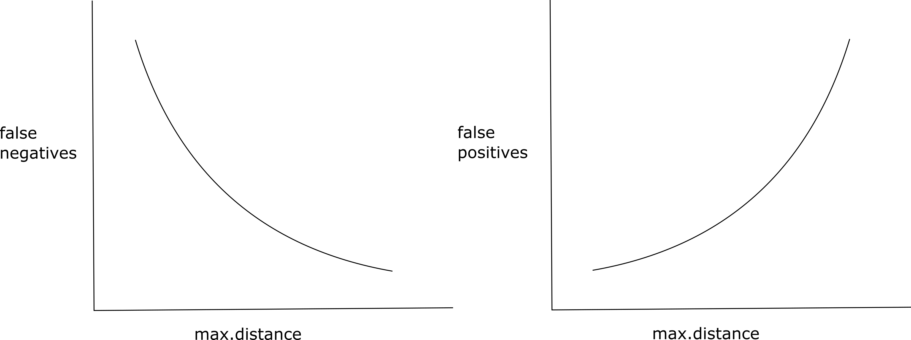
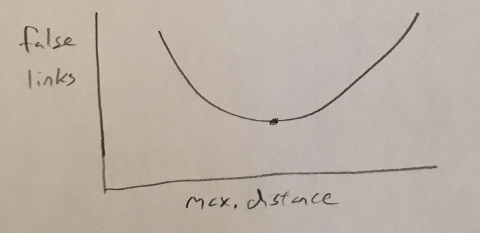

# Customer Deduplication

State agencies include customer IDs for tracking customers over time, but their ability to connect purchases by people to specific IDs is imperfect. Agencies have improved in this capability over time, and we would prefer not to deduplicate, but it may be necessary if we detect a high enough estimated duplication rate.

## Duplicate Checking Method

Through past experience, Southwick analysts have generally agreed on a convention of using exact matches of date of birth and partial names (first 2 letters of first name, first 3 letters of last name) rather than a more generalized (but time consuming) fuzzy-matching algorithm or [Record Linkage Package](https://journal.r-project.org/archive/2010/RJ-2010-017/RJ-2010-017.pdf). 

## Choosing Whether to Deduplicate

Deduplication inherently involves a tradeoff of [false positives vs. false negatives](#false-negatives-vs-false-positives) which I discuss in more detail at the end of this document. The upshot: statistically speaking, if we choose to deduplicate, then we are guaranteed to produce some number of false positives (distinct customers who we identify as the same). We must balance this against the potential for a high number of false negatives (customers with multiple IDs) if we choose not to deduplicate.

With dashboards, I've generally chosen a conservative approach in which we stick with the state-provided customer ID unless our estimated deduplication rate is above 4-5% or so (and then only deduplicate with agency permission). This percentage threshold is somewhat arbitrary, but deduplication involves a fair amount of work, and it's difficult to know for sure whether our new customer ID provides more accurate estimates of participants/churn/etc than the state-supplied customer ID. Hence, I've erred on the side of caution with deduplication.

## Deduplication Code Example

If you do need to deduplicate, you can access functions in salic and salicprep that should make your job easier. The below code:

1. Runs through a number of duplication checking steps
2. Identifies and Removes duplicates
3. Runs final deduplication checks

Code for a given state may diverge somewhat from that shown below, but this should provide a good starting point.

```r
# check: exact dups? (nope)
nrow(cust)
nrow(cust) == length(unique(cust$cust_id))
nrow(cust) == distinct(cust, cust_id, sex, dob, last, first, state, cust_res) %>% nrow()

# check: one customer for multiple cust_ids? (yes)
# - this is a fairly high apparent duplication rate
select(cust, dob, last, first) %>% check_dups()
dup <- count(cust, first, last, dob) %>% filter(n > 1)
summary(dup$n)

# check: using 3 letters in last, 2 letters in first
# - potentially higher false positive for lower false negative rates
cust <- cust %>%
    mutate(first2 = str_sub(first, end = 2), last3 = str_sub(last, end = 3))
select(cust, dob, last3, first2) %>% check_dups() # about 2% higher
dup <- count(cust, first2, last3, dob) %>% filter(n > 1)
summary(dup$n) 

# identify duplicates: using dob, last3, first2
cust <- cust_dup_identify(cust, dob, last3, first2)
cust_dup <- cust_dup_pull(cust)

# - summarize duplication
cust_dup_pct(cust, cust_dup)
cust_dup_demo(cust, cust_dup) %>% cust_dup_demo_plot()
cust_dup_year(cust, cust_dup, sale)

# update customer IDs in the sale table
# - this ensures we don't lose transactions associated with the old cust_id
sale <- sale %>%
    rename(cust_id_raw = cust_id) %>%
    left_join(select(cust, cust_id, cust_id_raw), by = "cust_id_raw")

# - for customers in sales but not in customer table, keep original cust_id
filter(sale, is.na(cust_id)) %>% distinct(cust_id_raw)
sale <- sale %>%
    mutate(cust_id = ifelse(is.na(cust_id), cust_id_raw, cust_id))

# remove dups from customer table
cust <- filter(cust, cust_id == cust_id_raw) # drop dups

# check
select(cust, dob, last3, first2) %>% check_dups() # ensure this is zero
filter(sale, is.na(cust_id)) # should be zero rows
```

## False Negatives vs False Positives

There is an inherent tradeoff if we choose to deduplicate records. If we estimate a high duplication rate in the state-provided customer ID, then we may have a situation in which the state's customer linkage has a high level of false negatives compared to false negatives. This might suggest to us that we could improve the customer linkage, but we need to be aware that any deduplication we pursue will produce both types of false identification. 

### Record Linkage

Deduplication is inherently a [record linkage](https://en.wikipedia.org/wiki/Record_linkage) problem. In theory, the false negative/positve tradeoff could be represented by the relationships below, where the `max.distance` parameter represents an argument to a function that links records (i.e., identifies duplicates) more aggresively as it increases (e.g., the `agrep()` function in R which I once used for deduplication in a project on the server: E:/SA/Projects/ASA/ASA-19-04 Retailer List Merge/). As the deduplication method becomes more aggressive at identifying duplicates, the number of false negatives decreases but the number of false positives increases. 



### Theoretical Optimum

In theory, we could identify an ideal `max.distance` value that produces the least number of false linkages. In practice, this would be quite laborious, although you could start to get a sense by taking samples over a range of `max.distance` values and visually inspecting the results to count false negatives/positives in each sample.


