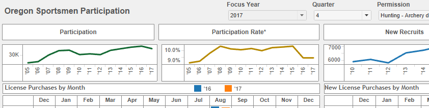
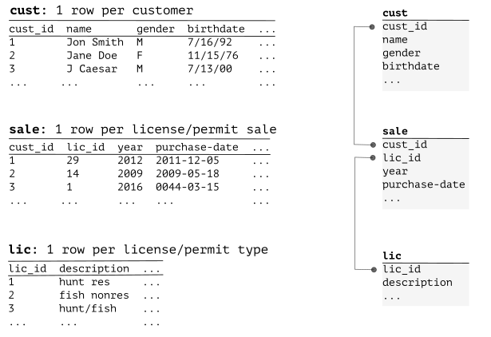
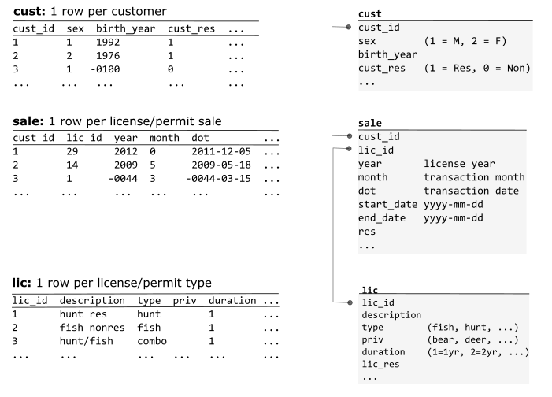
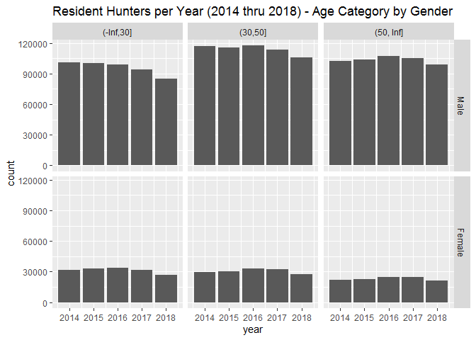

Dashboard Analyst Introduction
================

Data dashboards provide a visual representation of hunting and fishing
license sales; summarizing both recent and long-term trends.
Participation metrics are presented for anglers and hunters as a whole
and also broken out over demographic groups, including residency,
gender, and age.

### Partial Snapshot of Tableau Dashboard



## Analyst Expectations

The analyst role in the dashboard production focuses on processing
hunting and fishing license data. The data comes from state agency
databases; the analysis task involves preparing and standardizing these
idiosyncratic data sources. The work expectations hinge upon capability
in an R-based workflow:

  - Connect to a Southwick server, accessed using Windows built-in VPN
    and Remote Desktop functionality.
  - Follow Southwick protocols to ensure security of sensitive data.
  - Adapt (or rewrite) template R scripts to process large data files
    (\~10+ million rows), utilizing available R resources to write and
    debug code.
  - Collaborate with a project manager to accurately process/validate
    data and troubleshoot data challenges.

## Input: Raw License Data

State agencies provide raw license data, which is typically separated
into three related tables. A generic example:



### Data Processing Goals

  - Validate to ensure complete and accurate data
  - Summarize to get a sense for licensing trends and state-specific
    data peculiarities
  - Standardize to facilitate efficient workflows
  - Anonymize to exclude sensitive information from production data
  - Create additional data categories to enable retrieval of customer
    trends

## Output: SQLite Database

The expected data processing output is superficially quite similar to
the data processing input, but is standardized across states and
structured in a way which makes it easy to extract participation metrics
for building interactive dashboards:



## Example R Code

I’ve included some example R code (and output) below to give a sense of
what a question-driven workflow might look like using the
[SQLite](https://db.rstudio.com/databases/sqlite/) production database.

  - Purpose: Ask a data question and answer using R
  - Question: How has the number of resident hunting licensed buyers
    changed over five years? In particular, what do the dynamics look
    like by age and gender?

<!-- end list -->

``` r
library(tidyverse)
library(DBI)

# pull data
db_production <- "E:/SA/Data-production/Data-Dashboards/IA/license.sqlite3"
con <- dbConnect(RSQLite::SQLite(), db_production)
sale_res <- tbl(con, "sale") %>%
    filter(res == 1, year >= 2014, year <= 2018) %>% # exclude nonresidents
    select(cust_id, year) %>%
    collect()
cust <- tbl(con, "cust") %>%
    select(cust_id, sex, birth_year) %>%
    collect()
dbDisconnect(con)

# produce visual to expore question
x <- sale_res %>%
    left_join(cust, by = "cust_id") %>%
    distinct() %>% # ensure one customer per year
    filter(!is.na(sex), !is.na(birth_year)) %>%
    mutate(
        sex = factor(sex, 1:2, c("Male", "Female")),
        age = year - birth_year,
        agecat = cut(age, breaks = c(-Inf, 30, 50, Inf))
    )

x %>%
    ggplot(aes(year)) +
    geom_bar() +
    facet_grid(sex ~ agecat) +
    ggtitle("Resident Hunters per Year (2014 thru 2018) - Age Category by Gender")
```

<!-- -->
