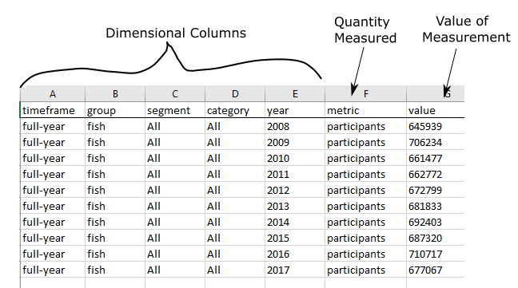

# License History & Summary Data

Once license data is stored in a standardized format, several functions can be applied in sequence to build the necessary summary data. The Southwick package `dashtemplate`  (installable from the Data Server: E:/SA/Projects/R-Software/Southwick-packages/build_binary/dashtemplate_0.1.zip) includes the relevant functions. The workflow has been documented in a github repo,  [dashboard-template](https://github.com/southwick-associates/dashboard-template), for sharing with state agency folks who choose to produce their own summary data.

### Summary Data States

Some states will produce their own summary data rather than sending license data. The [sadashreg](https://github.com/southwick-associates/sadashreg) package includes functions for validating and organizing the summary data that we receive from these states.

### Workflow Documentation

Information about the corresponding data structures and workflow is included in the package `salic` documentation:

- [License History](https://southwick-associates.github.io/salic/articles/salic.html#license-history) is an intermediate data structure built from the standardized cust, lic, sale tables.
- [Dashboard Metrics](https://southwick-associates.github.io/salic/articles/salic.html#dashboard-metrics) represent the calculated metrics (participants, churn, etc.) stored in a single csv file for import into Tableau.

## Summary Data Request Documentation

State agencies that are considering building their own summary data are sent an 8-page Word document that details the required data. The relevant sections from that document are copied below.

- [Overview & Scope](#overview-&-scope)
- [Requested Format](#requested-format)
- [Data Definitions](#data-definitions)

### Overview & Scope

Dashboards require summarized data that focus on customer-level dynamics (as opposed to license summaries which typically look at license-level dynamics such as total sales, percent changes, etc.). The customer-level focus relies on a customer ID, which enables trending on metrics such as churn and recruitment.

#### Data Pull Frequency: Twice per Year

Summary datasets should be sent to Southwick Associates twice per year for the duration of the project; corresponding to full-year and mid-year dashboards.

#### Data Filter: Only customers aged 18-64 each year

To facilitate a consistent comparison across states, only customers aged 18-64 each year should be included in the summary results. For example, suppose a man aged 64 in 2015 buys a fishing license in both 2015 and 2016. He should be included in the 2015 summary statistics, but not for those in 2016. Note that youths and seniors are excluded because states vary in whether they issue licenses for these age groups. The corresponding age filter should be applied as a final step, so that recruitment/churn is still captured to the degree possible.

#### Metrics to Include

Four summary statistics (metrics) are to be calculated by state agencies:

- Participants: number of hunting or angling license holders
- Residents: participants filtered to include only state residents
- Recruits: participants filtered to include only those considered new participants
- Churn: percent of participants who didn’t renew in a given year (only for full-year dashboard)

#### Dimensions by which to Summarize

Summary statistics are to be presented across several dimensions:

- group: either anglers, hunters, or all sportspersons
- segment: demographic extent (details on page 4)
- year: calendar year (January 1 through December 31). Multi-year and lifetimes are addressed below.
- timeframe: either full year or first six months

### Requested Format

A single table of summary data (stored in a .csv or similar tabular data format) is needed for input to each iteration of the Data Dashboard. Summary tables should include all requested years of angler/hunter summary statistics stored in 7 columns:

- timeframe: The time period covered:
    + "full-year" includes all customers each calendar year
    + "mid-year" includes only customers with licenses purchased during the first six months of the calendar year (Jan 1 through June 30) 
    
- group: The group of sportspersons described (hunt, fish, all_sports). Note that "all_sports" is an overall group referring to customers holding a hunting license, a fishing license, or both. Customers holding combination hunting/fishing licenses should be included in all three groups.

- segment: Demographic breakout of sportspersons ("All", "Residency", "Gender", "Age")

- category: Selected category of the segment (example for age: "18-24", "25-34", etc.)

- year: Calendar year of license purchase (2009, 2010, …)

- metric: Quantity measured ("participants", "residents", "recruits", "churn")

- value: The calculated numeric measure for the selected metric & dimension

**Example:** Total fishing participation by year

### Data Definitions

#### Metrics

Five metrics of interest are used to characterize participation dynamics. Definitions with examples are included below.

1. **Participants** – The total number of unique sportspersons (anglers or hunters) who purchased (or carried over) a license/permit each year.

2. **Residents** – The number of participants who are also state residents. This will be used by Southwick Associates for calculating participation rate.

3. **Recruits (New Participants)** – The number of new customers who purchased a license; defined as participants who bought a license in a given year, but didn’t buy a license granting that permission in any of the previous 5 years. For example, a new fishing participant in 2015 may have bought a fishing license in 2009 (or earlier) but did not buy a fishing license anytime from 2010 to 2014.

4. **Churn Rate** – This metric demonstrates annual turnover in fishing or hunting, and only applies to the full-year time period. Of the total number of customers that buy a license in a given year, churn is the percentage of those customers who fail to buy a license in the next year. For example, suppose 100,000 people held a fishing license in your state in 2017. Of these anglers, only 60,000 of them held a fishing license in the following year (2018). The churn rate for 2018 therefore equals 40,000 / 100,000 (40%).

5. **Participation Rate** – The ratio of unique sportspersons (state residents only) to the state population for a given customer segment. Southwick Associates will calculate participation rate using state-supplied resident participant counts in conjunction with an in-house database of relevant US Census data (Southwick updates this database annually to reflect the most recent estimates).

#### Demographic Segments

Metrics are to be further summarized at the three demographic dimensions for specified categories:

- **Residency** (Resident or Nonresident): Where a resident is someone who lives in the state. Identifying residency can be challenging and we suggest using the following priority to do so: (1) license type, (2) other purchases by the customer, and (3) customer address.

- **Gender** (Male or Female)

- **Age** (18-24, 25-34, 35-44, 45-54, 55-64). The age is calculated by simply subtracting current year from birth year.

#### Treatment of Multi-year & Lifetime Licenses

- **Multi-year**: For identifying participation, the licenses should be counted in the year of purchase, and also for subsequent years remaining. For example, a person who purchases a 3-year license in 2017 would be counted as a participant in 2017, 2018, and 2019.

- **Lifetime**: License sales over the requested time period should be included, and every subsequent year following a person’s purchase should also be counted towards participation. This approach involves a necessary compromise because there is usually no way to track participation for lifetime license holders with 100% certainty. The approach to counting lifetime licenses was selected for its simplicity; agencies need only consider records since 2008. Excluding prior years was considered acceptable since lifetime license holders typically make up a very small percentage of hunters and anglers in a state, and archived license records are often challenging to link with current license databases.

#### Treatment of Missing Data

It is expected that certain customer characteristics (e.g., gender, age, residency) will be unknown for a small percentage of records. When estimating results by demographic segment, the demographic percentages should be scaled to match totals. For example, say 100 thousand people buy fishing licenses where 69% are male, 30% are female, and 1% are gender unknown. The estimated number of males should equal 100,000 * 69 / (69+30), and females should equal 100,000 * 30 / (69+30). As long as the percentage of missing is small, than this is likely a reasonable estimate.
