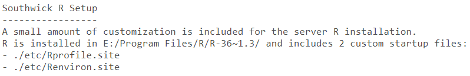
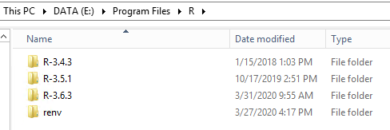
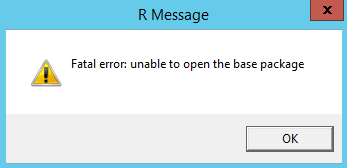
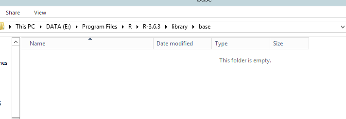
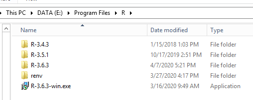
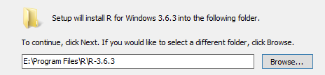
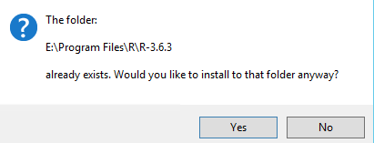

# R on the Data Server

R and Rstudio are available on the server for all Remote Desktop users. Rstudio should detect the existing R install with no problem when first launched (and default to the most recent version, 3.6.3 as of April 2020).

### Contents

- [Usage](#usage)
- [Installation Customization](#installation-customization)
- [Reinstalling/Updating R](#reinstalling-and-updating-r)
- [Fatal Error Troubleshooting](#fatal-error-troubleshooting)

## Usage

To get started, first launch Rstudio (e.g., click on start menu and type "RStudio"). You should then make some changes to the Rstudio settings (see [Rstudio Recommended Settings](rstudio-settings.md)). I also recommend using [RStudio Projects](https://r4ds.had.co.nz/workflow-projects.html) to organize your analyses.

When you open Rstudio, you should see a customized startup message in the R console. This customization is very minor (and shouldn't impact your work), but you can get more information in the [Installation Customization](#installation-customization) section below.



### R Package Libraries

Every user will have access to two R package libraries, which you can view by running `.libPaths()` from the R console:

```r
.libPaths()
## [1] "C:/Users/Dan Kary/Documents/R/win-library/3.6.3"
## [2] "E:/Program Files/R/R-3.6.3/library"
```

These two libraries serve distinct purposes:

1. The first element of the vector returned by `.libPaths()` represents the default package installation location (e.g., if you run `install.packages()`). This user library is a place for packages that only you have access to, and you are welcome to install any packages you want here.

2. The second element represents the system library (i.e., those that come with the base R installation). You shouldn't install packages here (although this shouldn't occur by default).

### Renv Project Libraries

The [renv package](https://rstudio.github.io/renv/index.html) provides a means to isolate project package libraries (useful for reproducibility and avoiding conflicts between ongoing projects). I recommend using renv for your project analyses if you are comfortable doing so. Renv makes use of a package cache located in the R install folder. This cache enables project-specific libraries (through linked folders) that can be installed/restored very quickly. 

## Installation Customization

R is installed on the E:/ drive instead of the default C:/ drive:



### Startup

A small amount of customization to the startup behavior is provided using two site files (`Rprofile.site` and `Renviron.site`). These are located in a subfolder of the R installation (`./R-3-6.3/etc/`). You can learn more about how R startup works by running `?Startup` from the console.

#### Rprofile.site

```r
# Defines some Southwick server setup

local({

# Set option - installation: binary
# This might help alleviate the occasional versioning issues with R on Windows
options(pkgType = "binary")

# Ensure a user path exists in .libPaths()
# - to prevent accidental installations into base R library
r_version <- paste(R.Version()$major, R.Version()$minor, sep = ".")
user_library_path <- file.path(Sys.getenv('R_USER'), 'R', 'win-library', r_version)

if (!dir.exists(user_library_path)) {
    dir.create(user_library_path, recursive = TRUE)
    .libPaths(user_library_path) # ensures availability on first use
}

# Print startup R message
cat(paste0(
    'Southwick R Setup\n-----------------\n',
    'A small amount of customization is included for the server R installation.\n',
    'R is installed in ', Sys.getenv('R_HOME'), '/',
    ' and includes 2 custom startup files:\n',
    '- ./etc/Rprofile.site\n',
    '- ./etc/Renviron.site\n\n'
))

})     
```

#### Renviron.site

```r
# Southwick Environmental Variables

# Version-specific user library
R_LIBS_USER ='${R_USER}/R/win-library/3.6.3'

# For package renv
# - location of global library cache
RENV_PATHS_ROOT = 'E:/Program Files/R/renv'

# - location of locally-stored packages (i.e., those not on github)
RENV_PATHS_LOCAL = 'E:/SA/Projects/R-Software/Southwick-packages/_builds_binary'

# For using the US Census API
CENSUS_API_KEY = '7ce74869fb8e921c9aacef808dc7c2180c1e1d73'
```

## Reinstalling and Updating R

### Reintalling

It's possible that something could go wrong with the R installation, and you'll want to start fresh. Fortunately this is very easy (and fast). Make sure to copy the Renviron.site and Rprofile.site documented above and then simply delete the relevant R version directory. Then you can [download R](https://cran.r-project.org/bin/windows/base/) and install to `E:/Program Files/R/`. Just place the site files under `./etc/` and you are good to go.

### Updating

Similar to reinstalling, but no deletion is required. Simply point to `E:/Program Files/R/` during install and the new version should be placed alongside existing R versions. Then copy over the site files from the previous version.

## Fatal Error Troubleshooting

The Data Server R install may have an issue in which the system library gets deleted (not sure why). More info and guidelines for fixing the issue are included below.

### The Error

You may see this error when trying to use R:



### The Problem

System libraries get deleted for some reason:



### The Fix

1. Reinstall R on the **E drive** by double-clicking the installation exe, accepting defaults **EXCEPT** the file path (which defaults to C):





It's okay to click on "Yes" to install to the existing folder (`Rprofile.site` and `Renviron.site` should be preserved). Then you can just click through the other defaults.



2. Open `.etc/Rprofile-site` and overwrite with the [Rprofile.site](#Rprofile.site) code.
