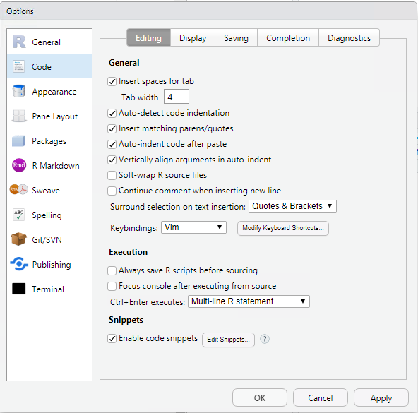

# RStudio Settings

You are welcome to customize your user-specific preferences on the Data Server (including RStudio). I recommend some non-default customization in RStudio below.

### Tools >> Global Options >> General

1. "Save workspace to .RData on exit": Never. We never want to do this with the large sensitive license datasets.
2. Use R version 3.6.3
3. Uncheck "Restore .RData into workspace at startup". 
4. Uncheck "Always save history" (although this is more of personal preference)

### Tools >> Global Options >> Code

Set tab width to 4:

