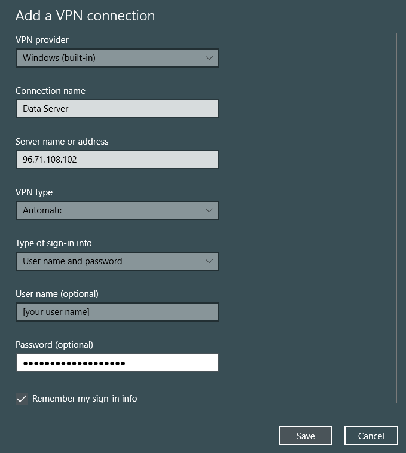
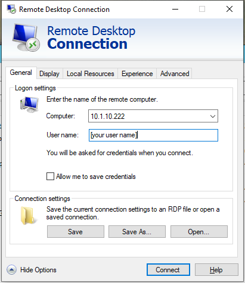

# Data Server Setup & Guidelines

Southwick Associates maintains a high-performance server in its office that can be accessed remotely (using a VPN) for license data processing. It supports up to 5 concurrent remote desktop users, and is intended for intensive workloads that use sensitive data.

Data used in processing dashboards is highly sensitive, and state license data **must never** be transferred to another machine (i.e., it can only live on the data server).

## Usage Rules

- Never transfer license data to another location.
- Lock your personal computer (or terminate the Southwick VPN) when you are away from your machine.
- Log off from the Server (Start >> log off) at the end of your work day.
- Don't install software without permission of the project manager.
- Be cognizant of how much of the shared resources you are using (particularly RAM) and avoid keeping resource heavy applications open when not in use.

## VPN & Remote Desktop Setup

Access to the server is provided for specific analysts using a VPN connection in conjunction with Windows Remote Desktop. User account credentials will be provided to each analyst by the project manager (see below for connection instructions).

### VPN

The server can only be accessed using a Southwick VPN (Virtual Private Network), which provides a secure channel between your personal computer and the server. Microsoft Windows has a built-in VPN connection utility. Before making a RD connection, users must establish a VPN connection:

Network Status >> VPN >> Add a VPN connection

Then click on the new VPN icon and connect. You can verify the VPN connection by clicking on the network icon in the task tray. The list of network options should show the VPN as connected. 

### Remote Desktop

Microsoft Windows has a built-in Remote Desktop (RD) application that can be used for connecting to the server. Once connected to the VPN, you can connect to Remote Desktop by clicking on the Windows start menu and typing "Remote Desktop Connection" >> Show Options and then enter your credentials:

When the RD window is active, the user's keyboard and mouse function as though they are connected directly to the server. Our RD license allows up to five concurrent connections to the server. This means that more than one (and up to five) people can be connected to the server at the same time without interfering with each other (although they must share the server's computing resources).

## Server File Organization

The dashboard analysis files are separated from data files:

| File Path | Function |
| --- | ---|
| E:/SA/Projects/Data-Dashboards/ | Analysis (code, etc.) by state |
| E:/SA/Data-sensitive/Data-Dashboards/ | License Data with personally-identifiable info |
| E:/SA/Data-production/Data-Dashboards/ | Anonymized License Data for producing dashboards |

## Server Software

A number of software applications are available on the Data Server in `E:/SA/Program Files/`. These don't (currently) have shortcuts and file associations, so you might need to add those manually by finding the file exe (e.g., right click > open with > browse for program). Notable applications:

- RStudio: An IDE for R. I recommend [some modifications](rstudio-settings.md) to the default user settings.
- DB Browser for SQLite. Provides an interactive way of exploring the SQLite datbases.
- Gedit: A text editor
- Ron's Editor: A spreadsheet-like csv editor, potentially useful for manual operations on license type tables
